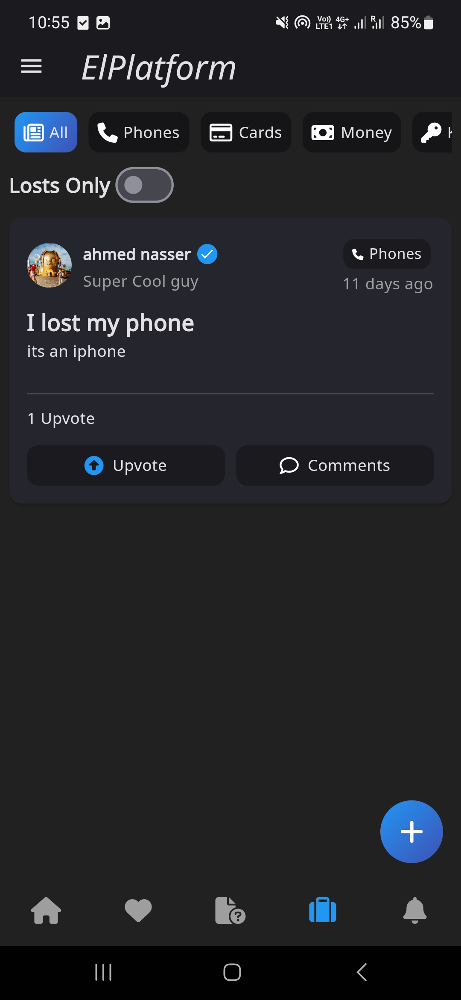
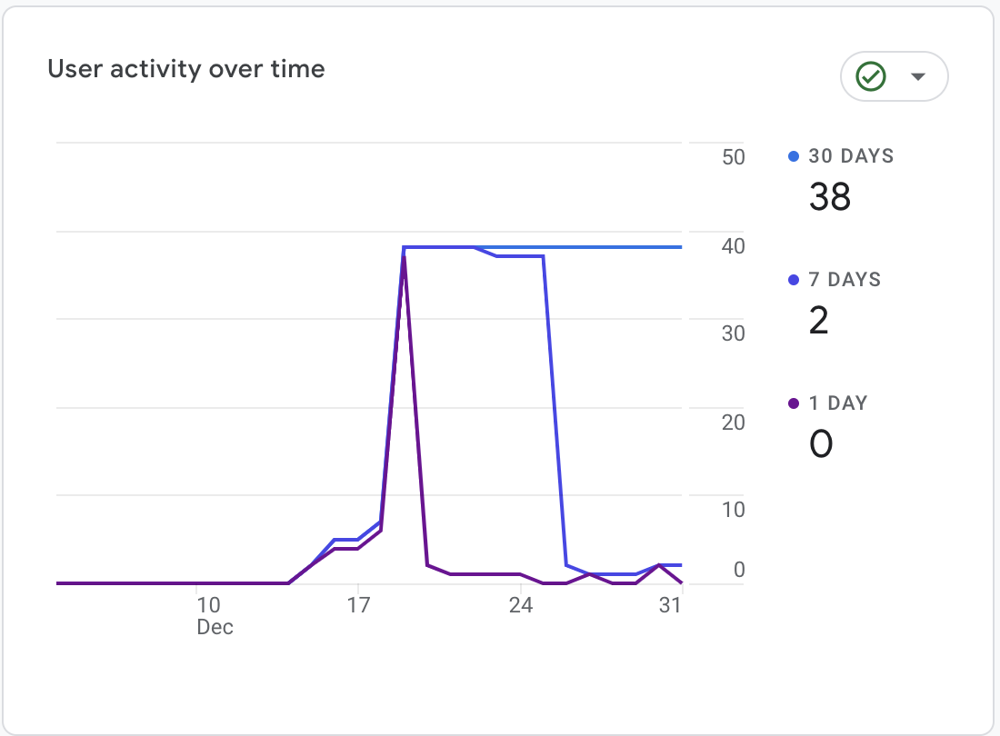
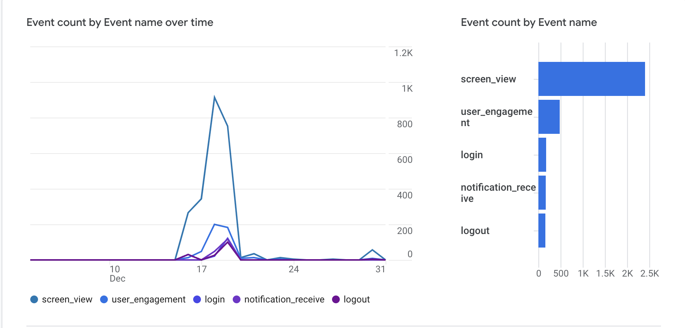

# ElPlatform

In this project, we are implementing a social media platform for the GUC community. The name "ElPlatform" references the platform area on the campus which is an area that involves lots of social activities, similar to our application. The main features of that app are the following:

- News feed, where authorized users can post announcements or news, while all the other users can interact like these posts or leave comments on them.
- Confessions, where users can post anything while having the option to hide or show their identity.
- Academic Q&A, which includes discussion forums for every faculty.
- Lost & Found, where users can post their lost items to find them or post the items they found to return them to their owners.
- Ratings & Reviews, where users can search for courses or instructors, review them, and read other people’s reviews about them.
- Offices & Outlets, where users can search for specific locations on the campus and the application will help them navigate their way to these locations.
- Important phone numbers, like the clinic, the hotline, etc. Users can call these numbers with one click on the app.

In addition to these features, there are features related to the administrators of the app, who can:
- Add courses or instructors.
- Approve or disapprove publish requests from users to allow them to post in the feed.
- Add phone numbers to the list of important phone numbers.

The client mobile application is implemented using Flutter while using Firebase Cloud Firestore as a database.

## UI/UX

### Feed

  
  
  
  

After the user signs in, they will be redirected to the home page, which displays the news feed. The news feed contains announcements and news posted by users who are allowed by admins to publish. If a non-publisher tries to post in the feed, a dialog opens telling them that they need to send a request to be publishers. The admin will review the request and the user will receive a notification when the request is approved or rejected. After the request is accepted, the user can publish posts on the news feed. Any user (publisher or not) can like or add comments to any post, and the owner of the post will be notified about it. In the home page, there is a drawer where the user can access some other pages like:

- GUC contacts
- Navigation
- Courses
- Instructors
- My profile

In addition, the user can navigate to some other pages using the bottom navigation bar like Confessions, Q&A, Lost & Found, and Notifications. The news feed is implemented using the StreamBuilder widget, so if a new post is added while scrolling, a toast will appear to the user telling them that new posts are available. The same thing is available in confessions, Q&A, and Lost & Founds.

### Confessions

  
  
  

The confessions page is very similar to the news feed. The only differences are that all users can post confessions without the need to request permissions and users can choose to post anonymously.

### Q&A

  

On the Questions and Answers page, users can ask academic questions and receive answers to them. Questions can be categorized by faculty to make it easier for the users to filter questions. If the user who asked the question received an answer to their question, they can mark their question as ’Answered’. This makes it easier to filter unanswered questions to make it easier for other users who are asking the same question to find the answer.

### Lost&Found

  
  

It is the same as the Q&A Section but with different categories. The user marks the post as found so that other users can see posts about lost items that have not been found yet.

### Ratings & Reviews

  
  
  
  

As we have seen before, users can go to courses or instructor pages from the drawer. On the courses page, a list of all courses provided by the university is found and users can search for a specific course by typing its title in the search bar. When the user clicks a course card or an instructor card, they will be redirected to the course/instructor details page. They will be able to see the available information about the course/instructor, a ratings summary, and a list of reviews. If they reviewed the course/instructor before they will be able to see their review while having the ability to edit or delete it. Otherwise, they will be able to review the course/instructor.

### Navigation

  
  
  

The Navigation page could be accessed from the drawer. The user can see a list of available locations that are updated regularly by the admin. They can search for a certain location by name. When the location is clicked, they can see a description of how to reach the location and the distance between the device and this location. In addition, there is a floating button that the user can click on to display an image with the university map.

### Important Phone Numbers

  

The GUC contacts page can be accessed from the drawer as well. There, the user can see a list of available contacts that is updated by the admin. When the user clicks on one of them, they will be redirected to the phone app to call the number directly.

### Notifications

  
  

Using the bottom NavBar, the user can go to the notifications page, where they can see a list of their notifications. White notifications are unread, while the dark ones are read. When a notification is clicked, it is marked as read and the user is redirected to the notification details page. The notifications are sent using Push Notification which is implemented by cloud functions. The user receives notifications in these cases:

- Receiving a like or a comment on any post (confession, Q&A, etc.). In this case, the notification details page will contain the post.
- A publish request is approved or rejected. In this case, clicking the notification does not redirect to a notification details page.
- When an admin receives a publishing request from a user. In this case, clicking the notification will redirect the admin to the publish requests page.

### Profile

  
  

The user can view their profile from the drawer or view other people’s profiles by clicking on their avatars. The user can edit their info or upload a new profile picture.

## Admin

The admin has his view on the system for special screens or the same screens of the users but with additional options. Admin has multiple functionalities explained in the following.

### Publish requests

  
  

Admin can View, Accept, or decline publish requests sent by the users.

### Instructors

  
  

Admin can add and delete instructors and the instructors' screen UI is modified accordingly to allow him to do both functionalities.

### Contacts

  
  

Admin can add and delete contacts and the instructors' screen UI is modified accordingly to allow him to do both functionalities. During add contact admin can specify its icon.

### Courses & Navigation

  
  

The same idea is implemented in both those sections.

## Usability Dataset

One of the main goals of this project was to build a dataset about users’ behavior in the app to do further analyses. To do that we tried different approaches.

### FireStore

we created a collection in the FireStore database to store these data called user_activity, this collection represents a single session for a user where it stores the session start time and the user ID and has a nested collection for activities where we track when the user visited each page if the app as shown below.

  

### Firebase Analytics

  
  

Another solution we used to capture the user activity data was integrating with Firebase analytics which tracks a lot of data and we have a different dashboard to provide better visualization. We track different events like screen view and we can know which page, when and from where the user tried to visit this page, login event, register event, logout event, view other’s profile dismiss notification, etc. These data can be utilized from different places for example you can use the Google Analysis dashboard to explore the data with a lot of filters and features to create the required view for analysis.

### Google Big Query

The data we capture in Firebase analytics are sent to Google Big Query, so we have more flexibility in dealing with the data and we can utilize SQL to explore and do analysis in the dataset.

