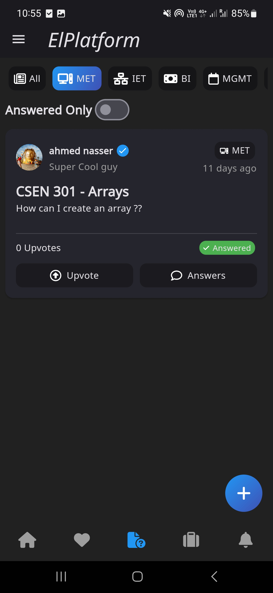
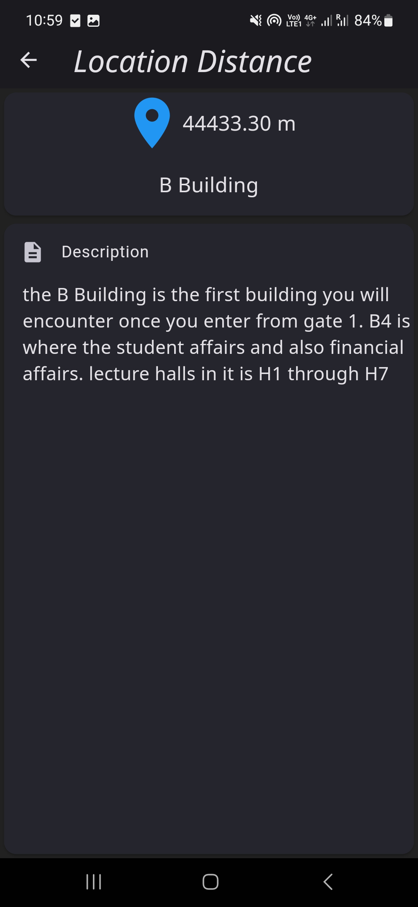

## CSEN 1114
## Mobile application development
## Winter 2023
ElPlatform
Team Members :
Abdelrahman Elsalh 49-18222
Ahmed Nasser 49-17266
Mohamed Khalid Almarsafy 49-9147
Ziad Ahmad Sadek Othman 49-17833

---

## Contents
1 Overview 2
2 Database 3
2.1 Users . . . . . . . . . . . . . . . . . . . . . . . . . . . . . . . . . . . . . . . 3
2.2 Questions . . . . . . . . . . . . . . . . . . . . . . . . . . . . . . . . . . . . 3
2.3 Confessions . . . . . . . . . . . . . . . . . . . . . . . . . . . . . . . . . . . 3
2.4 Feed . . . . . . . . . . . . . . . . . . . . . . . . . . . . . . . . . . . . . . . 3
2.5 Lost&Found . . . . . . . . . . . . . . . . . . . . . . . . . . . . . . . . . . . 4
2.6 Comments . . . . . . . . . . . . . . . . . . . . . . . . . . . . . . . . . . . . 4
2.7 Courses . . . . . . . . . . . . . . . . . . . . . . . . . . . . . . . . . . . . . 4
2.8 Instructors . . . . . . . . . . . . . . . . . . . . . . . . . . . . . . . . . . . . 4
2.9 Contacts . . . . . . . . . . . . . . . . . . . . . . . . . . . . . . . . . . . . . 4
2.10 Locations . . . . . . . . . . . . . . . . . . . . . . . . . . . . . . . . . . . . 4
2.11 Notifications . . . . . . . . . . . . . . . . . . . . . . . . . . . . . . . . . . . 5
2.12 Publish Request . . . . . . . . . . . . . . . . . . . . . . . . . . . . . . . . . 5
3 User Interface and User Experience 5
3.1 Feed . . . . . . . . . . . . . . . . . . . . . . . . . . . . . . . . . . . . . . . 5
3.2 Confessions . . . . . . . . . . . . . . . . . . . . . . . . . . . . . . . . . . . 6
3.3 Q&A . . . . . . . . . . . . . . . . . . . . . . . . . . . . . . . . . . . . . . . 7
3.4 Lost&Found . . . . . . . . . . . . . . . . . . . . . . . . . . . . . . . . . . . 8
3.5 Ratings & Reviews . . . . . . . . . . . . . . . . . . . . . . . . . . . . . . . 9
3.6 Navigation . . . . . . . . . . . . . . . . . . . . . . . . . . . . . . . . . . . . 10
3.7 Important Phone Numbers . . . . . . . . . . . . . . . . . . . . . . . . . . . 11
3.8 Notifications . . . . . . . . . . . . . . . . . . . . . . . . . . . . . . . . . . . 12
3.9 Profile . . . . . . . . . . . . . . . . . . . . . . . . . . . . . . . . . . . . . . 13
4 Admin 13
4.1 Publish requests . . . . . . . . . . . . . . . . . . . . . . . . . . . . . . . . . 14
4.2 Instructors . . . . . . . . . . . . . . . . . . . . . . . . . . . . . . . . . . . . 14
4.3 Contacts . . . . . . . . . . . . . . . . . . . . . . . . . . . . . . . . . . . . . 15
4.4 Courses & Navigation . . . . . . . . . . . . . . . . . . . . . . . . . . . . . . 16
5 Usability Dataset 17
5.1 FireStore . . . . . . . . . . . . . . . . . . . . . . . . . . . . . . . . . . . . . 17
5.2 Firebase Analytics . . . . . . . . . . . . . . . . . . . . . . . . . . . . . . . 18
5.2.1 Google Big Query . . . . . . . . . . . . . . . . . . . . . . . . . . . . 20
CSEN 1114 ElPlatform 1

---

1 Overview
Figure 1: ElPlatform Logo
In this project, we are implementing a social media platform for the GUC community.
The name "ElPlatform" references the platform area in the campus which is an area that
involves lots of social activities, similar to our application. The main features of that app
are the following:
• News feed, where authorized users can post announcements or news, while all the
other user can interact like these posts or leave comments on them.
• Confessions, where users can post anything while having the option to hide or show
their identity.
• Academic Q&A, which includes discussion forums for every faculty.
• Lost & Found, where users can post their lost items to find them or post the items
they found to return them to their owners.
• Ratings & Reviews, where users can search for courses or instructors, review them,
and read other people’s reviews about them.
• Offices & Outlets, where users can search for specific locations on the campus and
the application will help them navigate their way to these locations.
• Important phone numbers, like the clinic, the hotline, etc. Users can call these
numbers with one click on the app.
In addition to these features, there are features related to the administrators of the app,
who can:
• Add courses or instructors.
• Approve or disapprove publish requests from users to allow them to post in the feed.
• Add phone numbers to the list of important phone numbers.
In the next sections, we will discuss the details of every component in the app, and how
it was implemented.
CSEN 1114 ElPlatform 2

---

2 Database
In this app, we used Firebase Cloud Firestore to host our database. We will discuss the
database’s main collections and their relations.
2.1 Users
This collection contains information about the users of the system. A document containing
the user info is created when a user signs up for the application. The mean fields of a
User document are:
• Some personal information like name, email, GUC ID, bio, header, profile picture
URL, etc.
• A boolean field that determines if a user can post in the news feed or not. If a user
can post, they are called a "Publisher".
• User type, which can be admin, instructor, or student.
2.2 Questions
This collection contains questions for the Q&A section. The main fields of a Question
document are:
• Category, which is the name of the faculty related to the question.
• Date created.
• List of the user IDs who up-voted this question.
• List of photos URLs attached to the question.
• Title and body.
• "is_resolved", a boolean value that determines if the question is answered or not.
• The ID of the user who posted it.
2.3 Confessions
Very similar to the Q&A collection, with the only differences are:
• An extra field that determines whether the confession is anonymous or not.
• It does not have the "is_resolved" field.
2.4 Feed
Contains the documents for announcements and news. Similar to the Confessions collec-
tion, the only difference is that there is no ’is_anonymous’ field.
CSEN 1114 ElPlatform 3

---

2.5 Lost&Found
Similar to the Q&A collection, the only difference is that the "is_resolved" field deter-
mines whether the item is found or not.
2.6 Comments
There are 4 collections for comments, every collection contains the comments on a certain
type of post (feed, confessions, Q&A, or lost & found). The fields of a document are:
• post_id
• user_id
• comment body
• date_created
2.7 Courses
This collection contains the details of the courses to be reviewed. The main fields are:
• Title and description.
• Photo URL
• The sum of all ratings given to the course out of 5. This can be divided by the
ratings count to get the average rating.
• A list of reviews. Each review is an object containing the reviewer ID, a rating out
of 5, and an optional review body.
2.8 Instructors
This collection contains the details of the instructors to be reviewed. It is similar to the
Courses collection.
2.9 Contacts
This collection contains the contact information for an important phone number. It
contains the phone number, title and an icon to be displayed.
2.10 Locations
This collection contains the locations inside the university that are used for navigation.
The main fields of the location document are:
• Longitude and latitude,
• Description of the location and how to get there.
• Location name.
CSEN 1114 ElPlatform 4

---

2.11 Notifications
This collection contains the notifications sent to users. The main fields of the notification
document are:
• Notification type.
• Message and title.
• The topic to which this notification is published.
2.12 Publish Request
This collection contains the publish requests sent to admins by users who want to be
publishers. The main fields of the publish request document are:
• User ID.
• Message and title.
• is_approved.
3 User Interface and User Experience
3.1 Feed
(a) News feed (b) Drawer (c) New Post (d) Request Access
Figure 2: Home page
After the user signs in, they will be redirected to the home page, which displays the news
feed. The news feed contains announcements and news posted by users who are allowed
by admins to publish. If a non-publisher tries to post in the feed, a dialog opens telling
CSEN 1114 ElPlatform 5

---

them that they need to send a request to be publishers. The request will be reviewed
by the admin and the user will receive a notification when the request is approved or
rejected. After the request is accepted, the user can publish posts on the news feed. Any
user (publisher or not) can like or add comments to any post, and the owner of the post
will be notified about it. In the home page, there is a drawer where the user can access
some other pages like:
• GUC contacts
• Navigation
• Courses
• Instructors
• My profile
In addition, the user can navigate to some other pages using the bottom navigation bar
like Confessions, Q&A, Lost & Found and Notifications. The news feed is implemented
using StreamBuilder widget, so if a new post is added while scrolling, a toast will appear
to the user telling them that there are new posts available. The same thing is available
in confessions, Q&A and Lost & Founds.
3.2 Confessions
(a) Confessions (b) Comments (c) New confession
Figure 3: Confessions
CSEN 1114 ElPlatform 6

---

The confessions page is very similar to the news feed. The only differences are that all
users can post confessions without the need to request permissions and users can choose
to post anonymously.
3.3 Q&A
Figure 4: Q&A
On the Questions and Answers page, users can ask academic questions and receive answers
to them. Questions can be categorized by faculty to make it easier for the users to filter
questions. If the user who asked the question received an answer to their question, they
can mark their question as ’Answered’. This makes it easier to filter unanswered questions
to make it easier for other users who are asking the same question to find the answer.
CSEN 1114 ElPlatform 7

---

3.4 Lost&Found
(a) Lost And Found Feed (b) Inquiring about a lost item
Figure 5: Lost & Found
It is the same as the Q&A Section but with different categories. The user marks the post
as found so that other users can see posts about lost items that are not found yet.
CSEN 1114 ElPlatform 8

---

3.5 Ratings & Reviews
(a) Courses (b) Course Details (c) Review Instructor (d) Instructor Details
Figure 6: Ratings & Reviews
As we have seen before, users can go to courses or instructor pages from the drawer. On
the courses page, a list of all courses provided by the university is found and users can
search for a specific course by typing its title in the search bar. When the user clicks a
course card or an instructor card, they will be redirected to the course/instructor details
page. They will be able to see the available information about the course/instructor, a
ratings summary, and a list of reviews. If they reviewed the course/instructor before they
will be able to see their review while having the ability to edit or delete it. Otherwise,
they will be able to review the course/instructor.
CSEN 1114 ElPlatform 9

---

3.6 Navigation
(a) Locations List (b) Location Details (c) Map
Figure 7: Navigation
The Navigation page could be accessed from the drawer. The user can see a list of available
locations that are updated regularly by the admin. They can search for a certain location
by name. When the location is clicked, they can see a description of how to reach the
location and the distance between the device and this location. In addition, there is a
floating button that the user can click on to display an image with the university map.
CSEN 1114 ElPlatform 10

---

3.7 Important Phone Numbers
Figure 8: Contacts
The GUC contacts page can be accessed from the drawer as well. There, the user can see
a list of available contacts that is updated by the admin. When the user clicks on one of
them, they will be redirected to the phone app to call the number directly.
CSEN 1114 ElPlatform 11

---

3.8 Notifications
(a) Notifications Tab (b) Notification Details
Figure 9: Navigation
Using the bottom NavBar, the user can go to the notifications page, where they can
see a list of their notifications. White notifications are unread, while the dark ones are
read. When a notification is clicked, it is marked as read and the user is redirected to
the notification details page. The notifications are sent using Push Notification which is
implemented by cloud functions. The user receives notifications in these case:
• Receiving a like or a comment on any post (confession, Q/A etc.). In this case, the
notification details page will contain the post.
• A publish request is approved or rejected. In this case, clicking the notification does
not redirect to a notification details page.
• When an admin receives a publishing request from a user. In this case, clicking the
notification will redirect the admin to the publish requests page.
CSEN 1114 ElPlatform 12

---

3.9 Profile
(a) Profile Page (b) Edit profile
Figure 10: Profile
The user can view their profile from the drawer or view other people’s profiles by clicking
on their avatars. The user can edit their info or upload a new profile picture.
4 Admin
The admin has his own view on the system for special screens or the same screens of the
users but with additional options. Admin has multiple functionalities explained in the
following.
CSEN 1114 ElPlatform 13

---

4.1 Publish requests
Admin can View, Accept or decline publish requests sent by the users.
(a) Publish Requests (b) Accept/Decline Publish request
Figure 11: Publish Requests
4.2 Instructors
Admin can add and delete instructors and the instructors' screen UI is modified accordingly
to allow him to do both functionalities.
CSEN 1114 ElPlatform 14

---

(a) Instructors (b) Add Instructor
Figure 12: Admin Instructors Screen
4.3 Contacts
Admin can add and delete contacts and the instructors screen UI is modified accordingly
to allow him to do both functionalities. During add contact admin can specify its icon.
CSEN 1114 ElPlatform 15

---

(a) Contacts (b) Add Contacts
Figure 13: Admin Contacts Screen
4.4 Courses & Navigation
The same idea is implemented in both those sections.
CSEN 1114 ElPlatform 16

---

(a) Courses (b) Add Course
Figure 14: Admin Courses Screen
5 Usability Dataset
One of the main goals of this project was to build a dataset about users’ behaviour in the
app to do further analyses. To do that we tried different approaches.
5.1 FireStore
we created a collection in the FireStore database to store these data called user_activity,
this collection represents a single session for a user where it stores the session start time
CSEN 1114 ElPlatform 17

---

and the user ID and has a nested collection for activities where we track when the user
visited each page if the app as shown in fig 15.
Figure 15: User activity over time
5.2 Firebase Analytics
Another solution we used to capture the user activity data was integrating with Firebase
analytics which tracks a lot of data and we have a different dashboard to provide better
visualisation as shown in fig 16, 17. We track different events like screen view and we
can know which page, when and from where the user tried to visit this page, login event,
register event, logout event, view other’s profile dismiss notification, etc.
These data can be utilised from different places for example you can use the Google
Analysis dashboard to explore the data with a lot of filters and features to create the
required view for analysis as shown in fig 19
CSEN 1114 ElPlatform 18

---

Figure 16: user activity dataset in firestore
Figure 17: Event count by Event name
CSEN 1114 ElPlatform 19

---

Figure 18: Event count by Event name
Figure 19: Data explorer with custom options
5.2.1 Google Big Query
The data we capture in Firebase analytics are sent to Google Big Query, so we have more
flexibility in dealing with the data and we can utilise SQL to explore and do analysis in
CSEN 1114 ElPlatform 20

---

the dataset as shown in fig 20 and fig 21
Figure 20: Explore data using SQL
Figure 21: Example of events schema
CSEN 1114 ElPlatform 21

---

